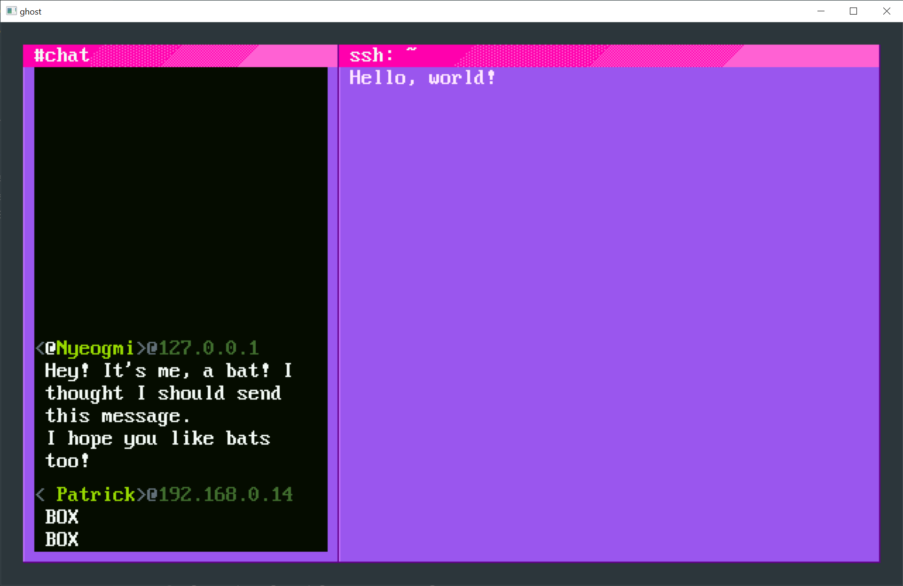

I've been playing a lot of hacking sims lately and decided to write some of the nuts and bolts of one.

This is an attempt to build a UI using my older library, chiroptui. To my horror, chiroptui has a _terrible_ API!

Right now this can draw some fake IRC chat. In the future I plan to draw a fake terminal using the same tools. 